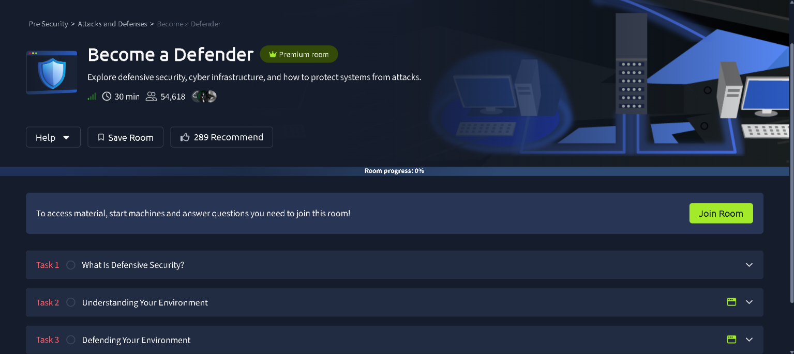
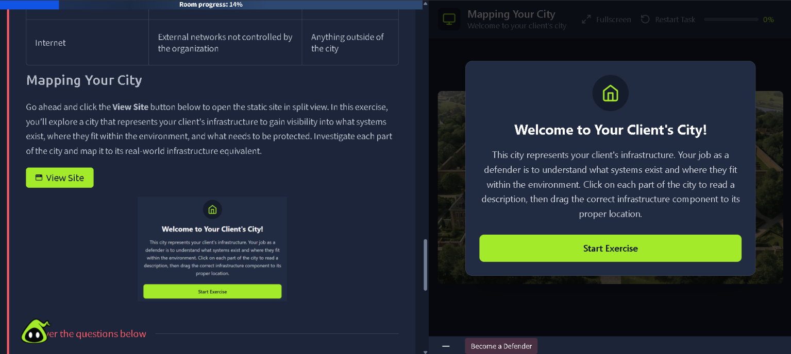
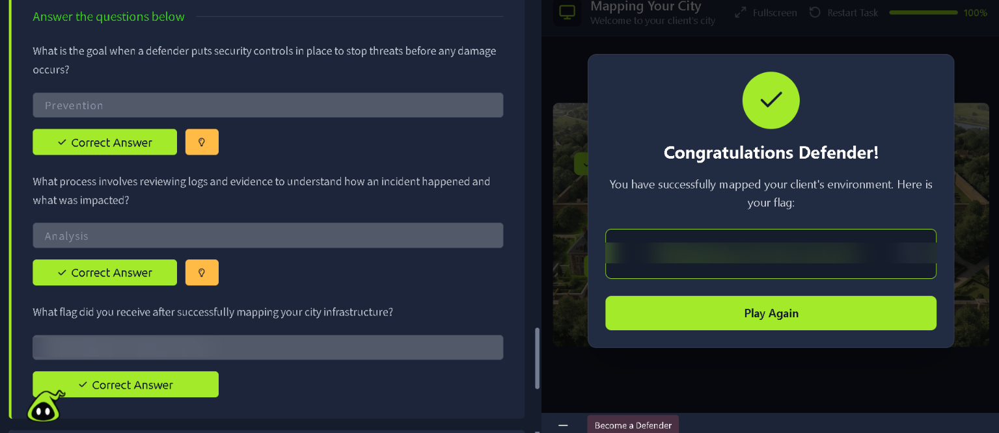
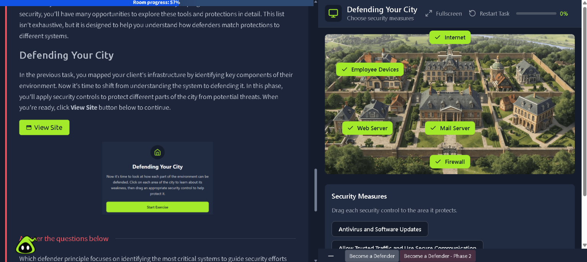
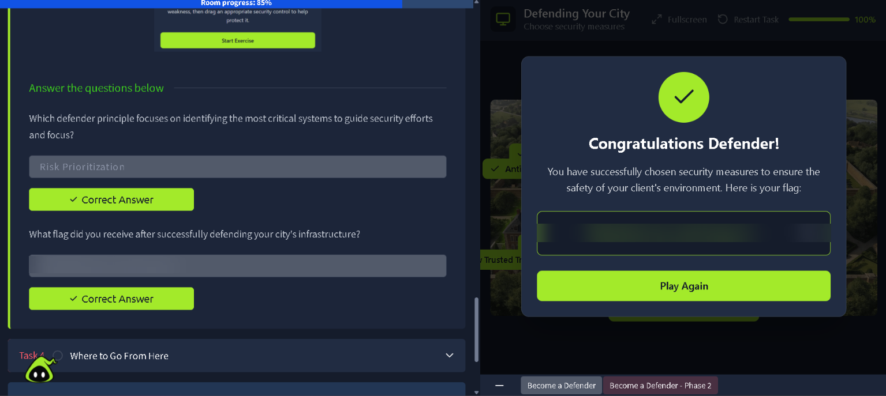

# TryHackMe: Become a Defender — Writeup

**Room:** [Become a Defender](https://tryhackme.com/room/becomeadefender) · Pre Security → Attacks and Defenses
**Difficulty:** Info / Beginner
**Status:** ✅ Room completed

> ⚠️ **Note:** The flag values have been redacted from the screenshots below. All techniques and reasoning remain fully visible — only the actual secret flag strings are blurred, so this stays a walkthrough rather than a spoonfeed.

## Overview

The defensive counterpart to *Become a Hacker* — this room walks through defensive security fundamentals using an interactive "client's city" metaphor for infrastructure: mapping out what systems exist, then applying the right security control to protect each one.

**Tasks:**
1. What Is Defensive Security?
2. Understanding Your Environment
3. Defending Your Environment
4. Where to Go From Here

---

## Task 2 — Understanding Your Environment (Mapping Your City)

The exercise represents a client's infrastructure as a city — each building or zone maps to a real-world infrastructure component (e.g. Internet = external networks not controlled by the organization). The goal is to click through each part of the city, read its description, and drag the correct infrastructure component to its proper location.

Successfully mapping every component of the client's environment returned a completion flag.

**Answers:**
| Question | Answer |
|---|---|
| What is the goal when a defender puts security controls in place to stop threats before any damage occurs? | `Prevention` |
| What process involves reviewing logs and evidence to understand how an incident happened and what was impacted? | `Analysis` |
| What flag did you receive after successfully mapping your city infrastructure? | *(redacted)* |

---

## Task 3 — Defending Your Environment

With the environment mapped, the next phase shifts from *understanding* the system to *defending* it. Each zone of the city (Internet, Employee Devices, Web Server, Mail Server, Firewall) has a specific weakness, and the task is to drag the correct security control onto the area it protects — e.g. **Antivirus and Software Updates** for endpoints, or **Allow Trusted Traffic and Use Secure Communication** for the firewall/network boundary.

Successfully applying the correct security measure to every zone returned a second flag.

**Answers:**
| Question | Answer |
|---|---|
| Which defender principle focuses on identifying the most critical systems to guide security efforts and focus? | `Risk Prioritization` |
| What flag did you receive after successfully defending your city's infrastructure? | *(redacted)* |

---

## Summary

This room reinforced the core defensive security mindset: you can't protect what you don't understand, so mapping infrastructure (what exists, where it sits, what it's exposed to) comes before defending it — then each part of the environment gets the security control suited to its specific risk (endpoint protection for devices, firewalling for network boundaries, etc.).

**Key takeaways:**
- Defensive security starts with visibility — asset/infrastructure mapping is a prerequisite for meaningful protection, not an afterthought.
- Different parts of an environment need different controls; a one-size-fits-all approach (e.g. only endpoint AV, no firewall rules) leaves gaps.
- Core defender principles — **Prevention**, **Analysis**, and **Risk Prioritization** — form the backbone of a proactive security posture, directly mirroring the offensive techniques covered in *Become a Hacker*.
